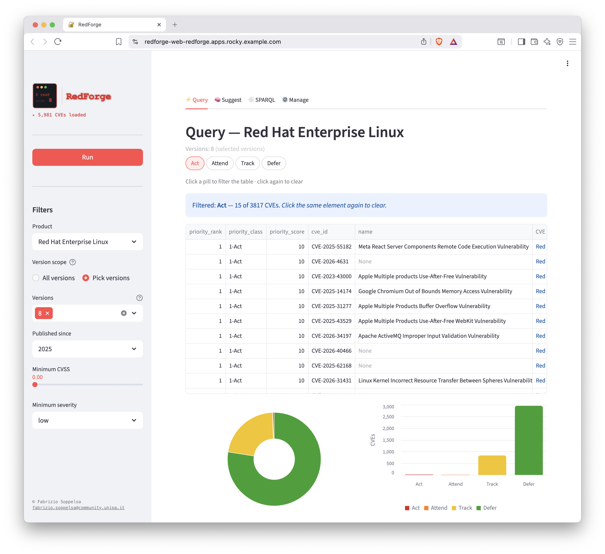
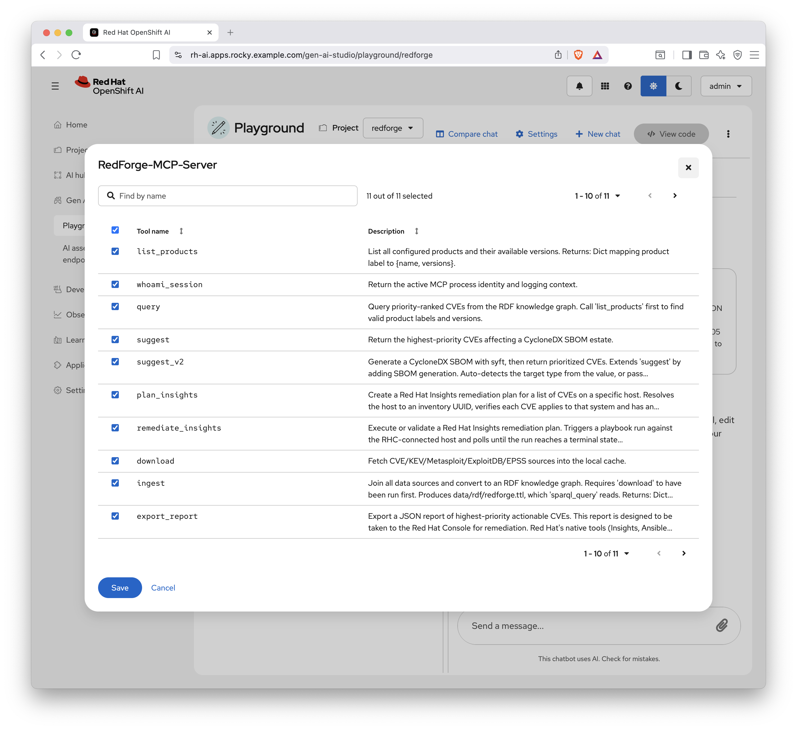
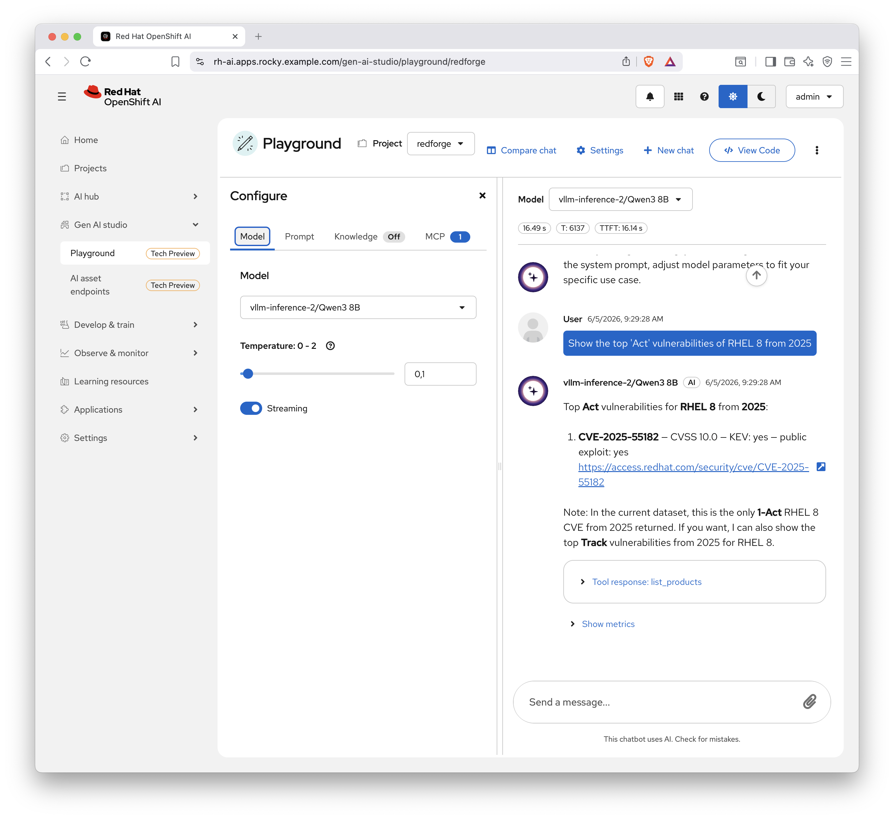

# RedForge

Vulnerability intelligence and remediation toolkit for Red Hat products.

## Overview

RedForge collects, normalizes, and enriches open vulnerability data for Red Hat products to support **patching prioritization** and **automated remediation**. The core insight is simple: a vulnerability should not be described by its CVSS score alone -- you also need to know whether it is actively exploited in the wild, whether public exploits exist, and how urgently it demands attention.

### Data sources

| Source | License | URL |
| ------ | ------- | --- |
| Red Hat CVE API | [CC BY 4.0](https://access.redhat.com/security/data) | [Security Data API](https://access.redhat.com/hydra/rest/securitydata/cve.json) |
| CISA KEV | CISA public feed; see [KEV Catalog](https://www.cisa.gov/known-exploited-vulnerabilities-catalog) | [KEV JSON](https://www.cisa.gov/sites/default/files/feeds/known_exploited_vulnerabilities.json) |
| Metasploit | BSD-style [metasploit-framework](https://github.com/rapid7/metasploit-framework) | [modules_metadata_base.json](https://raw.githubusercontent.com/rapid7/metasploit-framework/master/db/modules_metadata_base.json) |
| Exploit-DB | [GPL-2.0-or-later](https://gitlab.com/exploit-database/exploitdb/-/blob/main/LICENSE.md) | [files_exploits.csv](https://gitlab.com/exploit-database/exploitdb/-/raw/main/files_exploits.csv) |
| GitHub Advisory DB | [CC BY 4.0](https://github.com/advisories) | [advisory-database tar.gz](https://codeload.github.com/github/advisory-database/tar.gz/refs/heads/main) |
| EPSS | [FIRST Services Terms](https://www.first.org/about/policies/terms) | [epss_scores-current.csv.gz](https://epss.cyentia.com/epss_scores-current.csv.gz) |
| Red Hat Insights | Red Hat Subscription | [Red Hat Insights API](https://console.redhat.com/api) |

### Pipeline

The pipeline has four layers:

1. **Acquisition** — fetch raw data from all configured sources and cache locally.
2. **Enrichment** — join sources on CVE ID; add operational signals: KEV, public exploits, EPSS.
3. **Classification** — assign each CVE to a priority class using an SSVC-inspired decision model.
4. **Interfaces** — expose results through CLI, Streamlit dashboard, and MCP server.

### Priority classification

RedForge uses an SSVC-inspired approach based on [arXiv:2506.01220](https://arxiv.org/pdf/2506.01220). The four priority classes are:

- **1-Act**: strong exploitation signals + high CVSS — act immediately.
- **2-Attend**: high risk but below the Act threshold — attend soon.
- **3-Track**: high CVSS but weak threat signals — track on the radar.
- **4-Defer**: low risk — defer to regular patch cycles.

This is more operationally useful than CVSS alone, because an actively exploited vulnerability demands attention before a theoretically severe but unexploited one.

### Remediation: Insights + Ansible

### Remediation workflow

RedForge exports a JSON report of actionable CVEs. Take the report to the Red Hat Console where native tools (Insights, Ansible Automation Platform) handle remediation. See `docs/integrations.md` for details.

### Ontology and knowledge graph

The ontology lives in `src/redforge/ontology/vuln.ttl`. It defines OWL classes, properties, and a severity vocabulary. The pipeline converts all joined data to RDF/Turtle and loads it into a local Virtuoso triplestore for SPARQL querying.

### Interfaces

- **CLI** — entry point: `redforge.py`
- **Dashboard** — Streamlit app: `app.py`
- **MCP server** — FastMCP server exposing CVE query, download, ingest, SPARQL, and report export tools.

### Redforge in action:

#### Generic query on RHEL 8



#### MCP tools selection in OpenShift AI



#### Run on a chatbot



### Standalone containerized stack

Defined in `podman-compose.yml`:

| Service | Description | Port |
| ------- | ----------- | ---- |
| `redforge-web` | Streamlit dashboard | 8501 |
| `redforge-mcp` | MCP server (HTTP) | 8000 |
| `virtuoso` | RDF triplestore / SPARQL endpoint | 8890, 1111 |
| `pellet` | Optional OWL reasoning service | — |

Manage the stack with `scripts/stack.py`:

```bash
python3 scripts/stack.py build
python3 scripts/stack.py start --profile minimal
python3 scripts/stack.py start --profile full
python3 scripts/stack.py status
python3 scripts/stack.py logs
python3 scripts/stack.py load
```

Profiles:
- `minimal` = web + virtuoso
- `full` = web + mcp + virtuoso + pellet

### Local installation

```bash
./install.sh
```

The script verifies Python 3.11+, installs dependencies, checks podman, and creates `redforge.toml` if missing.

### Documentation

- `docs/design.md` — architecture and design decisions.
- `docs/ontology.md` — OWL ontology reference.
- `docs/deployment.md` — production deployment guide.
- `docs/integrations.md` — Red Hat Insights + Ansible integration.
- `docs/api.md` — MCP server API reference.

### License

See `LICENSE`.
